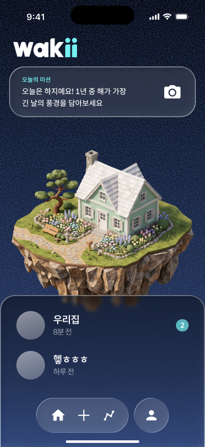
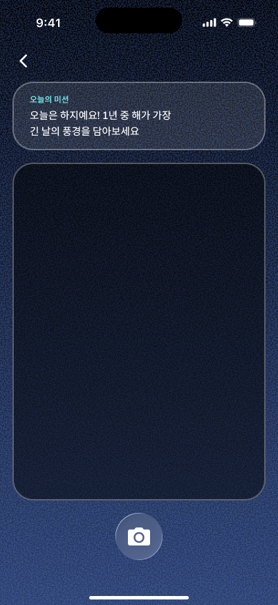
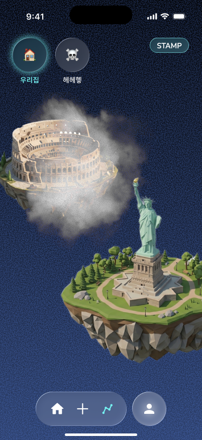

# 🏠 와키 (wakii)

**가족과 함께 사진(짤)을 남기고, 함께 걷는 모바일 웹앱.**

🔗 **바로가기:** https://wakii-tau.vercel.app

## 💡 와키란?

떨어져 사는 가족도 매일 자연스럽게 연결되게 하는 앱입니다.
단톡방처럼 부담스럽지 않게, 짧은 사진 한 장(짤)과 가벼운 반응으로 서로의 하루를 나눠요.

> "가족 채팅방은 어색하고, 안부 전화는 부담스럽다." — 그 사이의 빈틈을
> 사진·걸음이라는 가벼운 행동으로 메우는 것이 와키의 목표입니다.

밤하늘을 배경으로 한 다크 테마, 떠 있는 "집 섬", 유리 질감(글래스모피즘) UI로
따뜻하면서도 몽환적인 우리 가족만의 공간을 만들었어요.

---

## 📱 화면 미리보기

<table>
<tr>
<td align="center"> <b>홈 · 우리 집</b></td>
<td align="center"> <b>오늘의 미션 촬영</b></td>
<td align="center"> <b>와키 · 함께 걷기</b></td>
</tr>
</table>

---

## ✨ 화면별 상세

### 🌙 홈 — 우리 집

밤하늘 위에 떠 있는 **우리 가족의 집 섬**이 홈의 중심이에요.

- **오늘의 미션 배너** — 상단 글래스 카드에 매일 새로운 사진 미션이 떠요
  ("1년 중 해가 가장 긴 날의 풍경을 담아보세요" 처럼). 카메라 버튼을 눌러 바로 촬영.
- **떠 있는 집 섬** — 온보딩에서 고른 우리 집(8종)이 밤하늘에 두둥실. 길게 누르면 집을 바꿀 수 있어요.
- **가족 방 목록** — 아래에서 끌어올리는 글래스 시트에 우리가 속한 가족 방들이 원형 아바타·마지막 활동 시간·새 사진 수와 함께 정렬돼요.
- **하단 내비게이션** — 홈 · ＋(올리기) · 걸음 · 마이. 유리 알약 형태의 커스텀 바.

 

### 📸 방 — 사진이 곧 대화

가족 방은 채팅처럼 최신 사진이 아래에 쌓이는 피드예요.

- **카드덱** — 같은 시간대 사진들이 겹겹이 쌓인 카드덱이 되고, 탭하면 **원형 갤러리(WebGL)**로 촤르륵 펼쳐져요.
- **이모지 반응** — 사진에 이모지를 던지면 화면 가득 와르르 쏟아져요(짧게 탭 = 이모지, 꾹 누르기 = 표정 사진 반응).
- **즉석 사진 반응** — 이모지를 꾹 누르면 **전면 카메라**로 지금 내 표정을 원형으로 찍어 바로 답해요.
- **꾸며서 답장** — 풀 에디터로 스티커·그림·텍스트·음성, 시간·날씨 스티커까지 얹어 답장 카드를 남겨요.
- **원본 보기 / 내리기** — 사진을 길게 누르면 원본 크게 보기, 내가 올린 사진은 내려요.

> 긴 글 대신 사진 한 장과 이모지로 참여할 수 있어, 말수 적은 가족도 부담 없이 낄 수 있어요.

### 🚶 와키 — 함께 걷기

흩어져 사는 가족의 걸음을 하나로 모아 **세계 랜드마크 코스**를 향해 함께 나아가요.

- **랜드마크 코스** — 에펠탑·콜로세움·자유의 여신상·타지마할·후지산 등 11개 코스. 한 번에 하나씩, 가족 걸음을 합산해 진행해요.
- **구름이 걷히는 완주** — 지도형 경로를 드래그·핀치 줌으로 탐험. 목표에 다가갈수록 랜드마크를 덮은 **구름이 서서히 걷히며** 모습을 드러내요. 완주하면 도장이 아니라 구름이 완전히 사라져요.
- **가족 아바타 & 완주 뱃지** — 상단에 함께 걷는 가족과 지금까지 완주한 랜드마크 뱃지가 모여요.
- **여정 리캡** — 완주하면 그동안 가족이 남긴 사진들 중 반응 많은 베스트 컷을 모아 **함께한 여정을 되돌아봐요.**

 

### 🎯 오늘의 미션 촬영

홈의 오늘의 미션을 탭하면 전용 촬영 화면으로 들어가요.

- 상단에 오늘의 미션 문구가 글래스 카드로 다시 떠서 무엇을 찍어야 할지 알려줘요.
- 큰 뷰파인더로 지금 눈앞의 풍경을 담고, 하단 유리 셔터 버튼으로 촬영.
- 찍은 사진은 바로 가족 방 미션 덱에 올라가 "오늘의 풍경"으로 공유돼요.

 

### 📅 마이

내가 올린 사진을 **달력**에서 한눈에 돌아보고, 걸음 리포트(주/월)로 우리 가족의 활동 기록을 확인해요.

---

## 🎬 시작하기

1. 이메일과 이름을 입력하고, 마음에 드는 **우리 집**을 골라요.
2. 새 가족 방을 만들거나, **초대 링크·참여 코드**로 기존 방에 들어가요.
3. 오늘의 미션을 찍어 올리고, 가족의 사진에 반응하고, 함께 걸어요!

가족 초대는 카카오톡 공유 링크(`/?j=코드`)로 보내면, 받은 사람은 코드 입력 없이 바로 방에 들어와요.

## 🛠 기술

- **Next.js 14** (App Router) · **React 18** · **TypeScript**
- 모바일 우선 순수 CSS 디자인(글래스모피즘 다크 테마), **WebGL 원형 갤러리**, **PWA** 지원
- 같은 방 사진·반응 **실시간 동기화**, 실시간 날씨 연동
- 전면 카메라(즉석 사진 반응)·음성 녹음(답장) 등 기기 기능 활용

## ☁️ 배포

`main` 브랜치에 push하면 Vercel로 자동 배포됩니다 → https://wakii-tau.vercel.app

> 화면이 바뀌지 않으면 대부분 브라우저/CDN 캐시예요. 시크릿창이나 강력 새로고침(⌘⇧R)으로 확인하세요.
